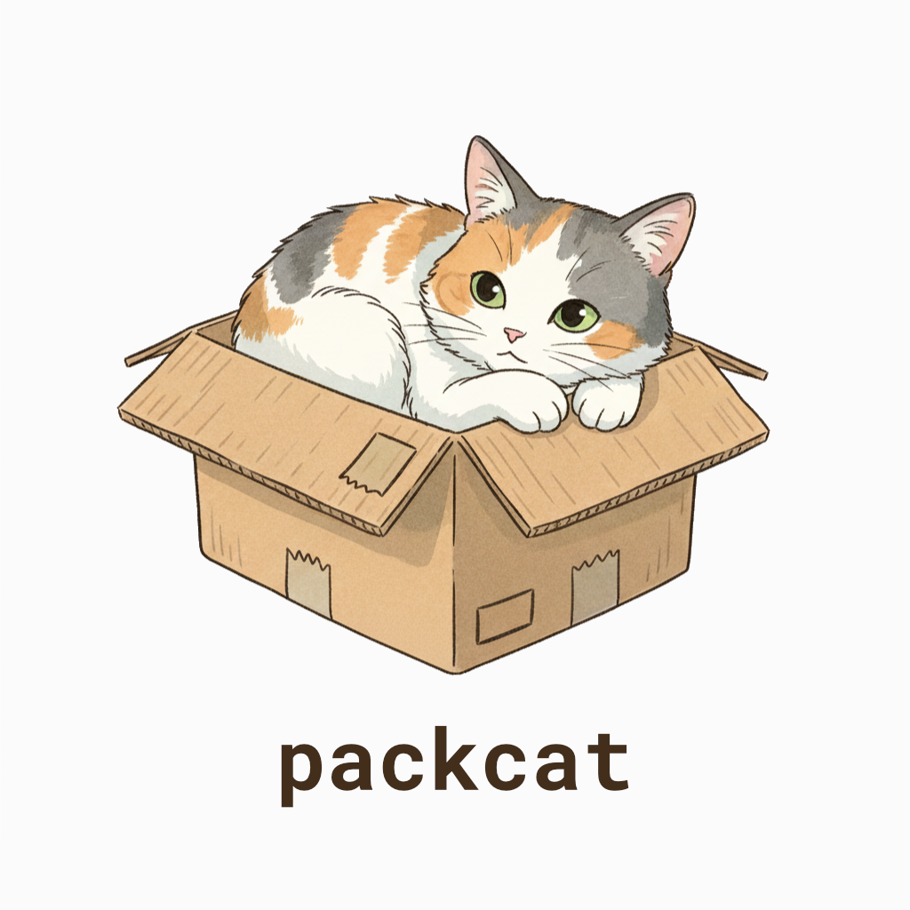

```sh
> npm install packcat
```

> 🚧 packcat is undergoing heavy development ahead of a v1 release. if you want to try it out early, go ahead! but prepare for breaking changes :)

# packcat

packcat is a small library for serializing and deserializing objects to and from buffers.

## Table Of Contents

- [Overview](#overview)
- [Usage](#usage)
- [API Documentation](#api-documentation)
  - [Ser/Des](#serdes)
  - [Schema](#schema)
    - [Schema Utilities](#schema-utilities)
    - [Schema Types](#schema-types)

## Overview

This library takes defined schemas, and then generates efficient functions that serialize and deserialize objects fitting the schemas into compact buffers.

It is great for use cases like networked games/apps where minimizing bandwidth is important, and both the client and server use javascript and can share schema definitions.

Currently there is no formal specification for the serialized data format, and no guarantees are made about the stability of the format between versions. As such, the same version of packcat should be used on both the serializing and deserializing end, and it is not recommended to persist serialized data.

This library assumes the host machine is little-endian in its use of JavaScript typed arrays. While supporting big-endian is technically possible, it falls outside the practical scope and realistic use cases of this library.

## Usage

First, define your data format with the schema utils:

```ts
import type { SchemaType } from 'packcat';
import { boolean, bitset, float32, list, literal, object, uint32, union } from 'packcat';

const playerInputSchema = object({
    frame: uint32(),
    nipple: list(float32(), 2),
    buttons: bitset(['jump', 'sprint', 'crouch'] as const),
    cmd: list(
        union('type', [
            // literals are not included in the serialised data, only used for discrimination
            object({ type: literal('interact') }),
            object({ type: literal('use'), primary: boolean(), secondary: boolean() }),
        ] as const),
    ),
});

type PlayerInputType = SchemaType<typeof playerInputSchema>;
```

Next, you can build the schema, which gives you `ser`, `des`, and `validate` functions, and use `SchemaType` to infer the TypeScript type of the schema:

```ts
import { build } from 'packcat';

const { ser, des, validate } = build(playerInputSchema);

const playerInput: PlayerInputType = {
    frame: 1,
    nipple: [0, 1],
    buttons: { jump: true, sprint: false, crouch: true },
    cmd: [{ type: 'interact' }, { type: 'use', primary: true, secondary: false }],
};

const u8 = ser(playerInput);

console.log(u8); // Uint8Array

const deserialized = des(u8);

console.log(deserialized); // { frame: 1, nipple: [ 0, 1 ], buttons: { jump: true, sprint: false, crouch: true }, cmd: [ { type: 'interact' }, { type: 'use', primary: true, secondary: false } ] }
```

You can also use `validate` if you don't trust whether the input data confirms to the schema type:

```ts
console.log(validate(playerInput)); // true

// @ts-expect-error this doesn't conform to the schema type!
console.log(validate({ foo: 'bar' })); // false
```

## API Documentation

### Ser/Des

```ts
export function build<S extends Schema>(schema: S): {
    ser: (value: SchemaType<S>) => Uint8Array;
    des: (u8: Uint8Array) => SchemaType<S>;
    validate: (value: SchemaType<S>) => boolean;
    source: {
        ser: string;
        des: string;
        validate: string;
    };
};
```

### Schema

#### Schema Utilities

```ts
/**
 * Boolean schema - stores true/false values using 1 byte.
 * 
 * @returns A boolean schema definition
 * 
 * @example
 * boolean() // Stores boolean value (1 byte)
 */
export function boolean(): {
    type: 'boolean';
};
```

```ts
/**
 * String schema - variable-length UTF-8 encoded strings.
 * 
 * Strings are prefixed with a varuint length followed by UTF-8 bytes.
 * 
 * @returns A string schema definition
 * 
 * @example
 * string() // Variable-length string
 */
export function string(): {
    type: 'string';
};
```

```ts
/**
 * Number schema - JavaScript number using Float64 (8 bytes).
 * 
 * This is equivalent to `float64()` but uses JavaScript's native number type.
 * For smaller numbers, consider using `float32()`, `int32()`, or `varint()`.
 * 
 * @returns A number schema definition
 * 
 * @example
 * number() // Standard JavaScript number (8 bytes)
 */
export function number(): {
    type: 'number';
};
```

```ts
/**
 * 8-bit signed integer (1 byte).
 * 
 * Range: -128 to 127
 * 
 * @returns An int8 schema definition
 * 
 * @example
 * int8() // 1 byte signed integer
 */
export function int8(): {
    type: 'int8';
};
```

```ts
/**
 * 8-bit unsigned integer (1 byte).
 * 
 * Range: 0 to 255
 * 
 * @returns A uint8 schema definition
 * 
 * @example
 * uint8() // 1 byte unsigned integer
 */
export function uint8(): {
    type: 'uint8';
};
```

```ts
/**
 * 16-bit signed integer (2 bytes).
 * 
 * Range: -32,768 to 32,767
 * 
 * @returns An int16 schema definition
 * 
 * @example
 * int16() // 2 bytes signed integer
 */
export function int16(): {
    type: 'int16';
};
```

```ts
/**
 * 16-bit unsigned integer (2 bytes).
 * 
 * Range: 0 to 65,535
 * 
 * @returns A uint16 schema definition
 * 
 * @example
 * uint16() // 2 bytes unsigned integer
 */
export function uint16(): {
    type: 'uint16';
};
```

```ts
/**
 * 32-bit signed integer (4 bytes).
 * 
 * Range: -2,147,483,648 to 2,147,483,647
 * 
 * @returns An int32 schema definition
 * 
 * @example
 * int32() // 4 bytes signed integer
 */
export function int32(): {
    type: 'int32';
};
```

```ts
/**
 * 32-bit unsigned integer (4 bytes).
 * 
 * Range: 0 to 4,294,967,295
 * 
 * @returns A uint32 schema definition
 * 
 * @example
 * uint32() // 4 bytes unsigned integer
 */
export function uint32(): {
    type: 'uint32';
};
```

```ts
/**
 * 64-bit signed integer (8 bytes) stored as BigInt.
 * 
 * Range: -9,223,372,036,854,775,808 to 9,223,372,036,854,775,807
 * 
 * @returns An int64 schema definition
 * 
 * @example
 * int64() // 8 bytes signed BigInt
 */
export function int64(): {
    type: 'int64';
};
```

```ts
/**
 * 64-bit unsigned integer (8 bytes) stored as BigInt.
 * 
 * Range: 0 to 18,446,744,073,709,551,615
 * 
 * @returns A uint64 schema definition
 * 
 * @example
 * uint64() // 8 bytes unsigned BigInt
 */
export function uint64(): {
    type: 'uint64';
};
```

```ts
/**
 * 16-bit floating point (2 bytes) - half precision.
 * 
 * Range: ±65,504 with ~3 decimal digits of precision
 * Useful for reduced bandwidth when full precision isn't needed.
 * 
 * @returns A float16 schema definition
 * 
 * @example
 * float16() // 2 bytes floating point
 */
export function float16(): {
    type: 'float16';
};
```

```ts
/**
 * 32-bit floating point (4 bytes) - single precision.
 * 
 * Range: ±3.4e38 with ~7 decimal digits of precision
 * 
 * @returns A float32 schema definition
 * 
 * @example
 * float32() // 4 bytes floating point
 */
export function float32(): {
    type: 'float32';
};
```

```ts
/**
 * 64-bit floating point (8 bytes) - double precision.
 * 
 * Range: ±1.7e308 with ~15 decimal digits of precision
 * This is JavaScript's native number type.
 * 
 * @returns A float64 schema definition
 * 
 * @example
 * float64() // 8 bytes floating point
 */
export function float64(): {
    type: 'float64';
};
```

```ts
/**
 * Literal schema - constant value that doesn't need to be serialized.
 * 
 * The value is part of the schema definition and takes 0 bytes to encode.
 * Useful for discriminators in unions or constant metadata.
 * 
 * @param value - The constant primitive value
 * @returns A literal schema definition
 */
export function literal<S extends PrimitiveSchema, V extends SchemaType<S>>(value: V): {
    type: 'literal';
    value: V;
};
```

```ts
export function list<T extends Schema, L extends number>(of: T, length?: L);
```

```ts
/**
 * Tuple schema - fixed-length array with heterogeneous types.
 * 
 * Each element can have a different schema. No length prefix is stored.
 * 
 * @param of - Array of schemas for each tuple element
 * @returns A tuple schema definition
 * 
 * @example
 * // Position with metadata: [x, y, timestamp]
 * tuple([float32(), float32(), uint32()])
 * 
 * @example
 * // Player data: [id, name, score]
 * tuple([uint16(), string(), varuint()])
 */
export function tuple<T extends Schema[]>(of: T): {
    type: 'tuple';
    of: [
        ...T
    ];
};
```

```ts
/**
 * Object schema - fixed set of named fields.
 * 
 * Fields are serialized in alphabetically sorted order (by field name).
 * Field names are not stored in the binary format.
 * 
 * @param fields - Record mapping field names to their schemas
 * @returns An object schema definition
 * 
 * @example
 * object({
 *   id: uint32(),
 *   position: tuple([float32(), float32(), float32()]),
 *   health: uint8()
 * })
 */
export function object<F extends Record<string, Schema>>(fields: F): {
    type: 'object';
    fields: F;
};
```

```ts
/**
 * Record schema - dynamic key-value map with homogeneous values.
 * 
 * Keys are strings, all values share the same schema.
 * Stored as varuint count followed by [key, value] pairs.
 * 
 * @param field - Schema for all values
 * @returns A record schema definition
 * 
 * @example
 * // Map of player IDs to scores
 * record(uint32())
 * 
 * @example
 * // Map of item names to quantities
 * record(varuint())
 */
export function record<F extends Schema>(field: F): {
    type: 'record';
    field: F;
};
```

```ts
/**
 * Uint8Array schema - raw byte buffer.
 * 
 * Without length: Variable-length buffer prefixed with varuint count
 * With length: Fixed-length buffer with no length prefix
 * 
 * @param length - Optional fixed length in bytes
 * @returns A Uint8Array schema definition
 * 
 * @example
 * // Variable-length binary data
 * uint8Array()
 * 
 * @example
 * // 16-byte UUID or hash
 * uint8Array(16)
 */
export function uint8Array(length?: number);
```

```ts
/**
 * Bitset schema - compact storage for boolean flags.
 * 
 * Each key uses 1 bit. Stored as a variable number of bytes based on key count.
 * More efficient than storing individual booleans for multiple flags.
 * 
 * @param keys - Array of flag names
 * @returns A bitset schema definition
 * 
 * @example
 * bitset(['hasShield', 'isInvincible', 'canFly', 'isGrounded'])
 * // Stores 4 flags in 1 byte
 */
export function bitset<Keys extends string[]>(keys: [
    ...Keys
]): {
    type: 'bitset';
    keys: [
        ...Keys
    ];
};
```

```ts
/**
 * Optional schema - value that can be undefined.
 * 
 * Uses 1 byte to indicate presence (0=undefined, 1=present), followed by the value if defined.
 * 
 * @param of - Schema for the defined value
 * @returns An optional schema definition
 * 
 * @example
 * optional(uint32()) // number | undefined
 * 
 * @example
 * optional(string()) // string | undefined
 */
export function optional<S extends Schema>(of: S): {
    type: 'optional';
    of: S;
};
```

```ts
/**
 * Nullable schema - value that can be null.
 * 
 * Uses 1 byte to indicate presence (0=null, 1=present), followed by the value if non-null.
 * 
 * @param of - Schema for the non-null value
 * @returns A nullable schema definition
 * 
 * @example
 * nullable(string()) // string | null
 * 
 * @example
 * nullable(object({ x: float32(), y: float32() })) // object | null
 */
export function nullable<S extends Schema>(of: S): {
    type: 'nullable';
    of: S;
};
```

```ts
/**
 * Nullish schema - value that can be null or undefined.
 * 
 * Uses 1 byte to indicate state (0=null, 1=undefined, 2=present), followed by the value if present.
 * 
 * @param of - Schema for the non-nullish value
 * @returns A nullish schema definition
 * 
 * @example
 * nullish(float32()) // number | null | undefined
 * 
 * @example
 * nullish(string()) // string | null | undefined
 */
export function nullish<S extends Schema>(of: S): {
    type: 'nullish';
    of: S;
};
```

```ts
/**
 * Union schema - discriminated union of object variants.
 * 
 * Each variant must be an object with a literal discriminator field.
 * The discriminator is used to determine which variant to deserialize.
 * 
 * @param key - Name of the discriminator field
 * @param variants - Array of object schemas, each with a literal for the key field
 * @returns A union schema definition
 * 
 * @example
 * union('type', [
 *   object({ type: literal('player'), id: uint32(), name: string() }),
 *   object({ type: literal('enemy'), id: uint32(), level: uint8() }),
 *   object({ type: literal('npc'), id: uint32(), dialog: string() })
 * ])
 */
export function union<K extends string, V extends (ObjectSchema & {
    fields: {
        [k in K]: LiteralSchema;
    };
})[]>(key: K, variants: [
    ...V
]): {
    type: 'union';
    key: K;
    variants: [
        ...V
    ];
};
```

```ts
/**
 * Quantize a floating point number to discrete steps within a range.
 * 
 * Values are encoded using the minimum number of bits needed to represent
 * all possible steps, rounded up to the nearest byte boundary.
 * 
 * You can specify precision either by step size or byte budget:
 * - `{ step }`: Desired step size, bytes are calculated
 * - `{ bytes }`: Byte budget, actual step is calculated
 * 
 * The actual step size may be slightly smaller than requested due to rounding
 * up to the nearest power of 2. For example, a range of 0-100 with step=1
 * requires 101 steps, which rounds to 128 (7 bits), giving an actual step
 * size of ~0.787.
 * 
 * @param min - Minimum value in the range
 * @param max - Maximum value in the range
 * @param precision - Either `{ step: number }` or `{ bytes: number }`
 * 
 * @example
 * // Rotation angle with 0.5° precision (uses 2 bytes, actual ~0.35°)
 * quantized(0, 360, { step: 0.5 })
 * 
 * @example
 * // Health percentage with 1 byte budget (actual step ~0.39)
 * quantized(0, 100, { bytes: 1 })
 * 
 * @example
 * // Position with 10cm precision (uses 2 bytes, actual ~3cm)
 * quantized(-1000, 1000, { step: 0.1 })
 * 
 * @example
 * // Normalized value with 1% increments (uses 1 byte, actual ~0.39%)
 * quantized(0, 1, { step: 0.01 })
 */
export function quantized(min: number, max: number, precision: {
    step: number;
} | {
    bytes: number;
} = { step: 0.01 }): {
    type: 'quantized';
    min: number;
    max: number;
    step: number;
    bytes: number;
};
```

```ts
/**
 * Compressed quaternion using "smallest three" encoding.
 * 
 * Since quaternions are unit length (x² + y² + z² + w² = 1), we can
 * store only the 3 smallest components and reconstruct the largest.
 * This uses significantly less space than storing all 4 components.
 * 
 * The encoding stores:
 * - Index of the dropped (largest) component (2 bits)
 * - Sign of the dropped component (1 bit)
 * - 3 quantized components
 * 
 * Component values range from -1/√2 to 1/√2, so the quantization step
 * is relative to this range (~1.414).
 * 
 * You can specify precision either by step size or byte budget:
 * - `{ step }`: Desired step size, bytes are calculated
 * - `{ bytes }`: Byte budget, actual step is calculated
 * 
 * @param precision - Either `{ step: number }` or `{ bytes: number }` (default: { step: 0.001 })
 * 
 * @example
 * // Default 0.001 precision (7 bytes)
 * quat()
 * 
 * @example
 * // High precision via step (7 bytes)
 * quat({ step: 0.0002 })
 * 
 * @example
 * // Low bandwidth via bytes (4 bytes, step ~0.002)
 * quat({ bytes: 4 })
 */
export function quat(precision: {
    step: number;
} | {
    bytes: number;
} = { step: 0.001 }): {
    type: 'quat';
    step: number;
    bytes: number;
};
```

```ts
/**
 * Compressed unit vector in 2D using angle encoding.
 * 
 * Since 2D unit vectors can be represented as a single angle (0 to 2π),
 * this is more efficient than storing x,y components. The angle range
 * is 0 to 2π (~6.283 radians).
 * 
 * You can specify precision either by step size or byte budget:
 * - `{ step }`: Desired step size in radians, bytes are calculated
 * - `{ bytes }`: Byte budget, actual step is calculated
 * 
 * @param precision - Either `{ step: number }` or `{ bytes: number }` (default: { step: 0.0015 })
 * 
 * @example
 * // Default ~0.09° precision (2 bytes)
 * uv2()
 * 
 * @example
 * // High precision ~0.006° via step (3 bytes)
 * uv2({ step: 0.0001 })
 * 
 * @example
 * // 1 byte budget (step ~0.025 radians = 1.4°)
 * uv2({ bytes: 1 })
 */
export function uv2(precision: {
    step: number;
} | {
    bytes: number;
} = { step: 0.0015 }): {
    type: 'uv2';
    step: number;
    bytes: number;
};
```

```ts
/**
 * Compressed unit vector in 3D using "smallest two" encoding.
 * 
 * Similar to quaternion compression, we exploit the unit length constraint.
 * We store the 2 smallest components and reconstruct the largest, plus
 * the index and sign of the dropped component.
 * 
 * Component values range from -1/√2 to 1/√2, so the quantization step
 * is relative to this range (~1.414).
 * 
 * You can specify precision either by step size or byte budget:
 * - `{ step }`: Desired step size, bytes are calculated
 * - `{ bytes }`: Byte budget, actual step is calculated
 * 
 * @param precision - Either `{ step: number }` or `{ bytes: number }` (default: { step: 0.001 })
 * 
 * @example
 * // Default 0.001 precision (3 bytes)
 * uv3()
 * 
 * @example
 * // Low bandwidth via bytes (2 bytes, step ~0.006)
 * uv3({ bytes: 2 })
 * 
 * @example
 * // High precision via step (4 bytes)
 * uv3({ step: 0.0002 })
 */
export function uv3(precision: {
    step: number;
} | {
    bytes: number;
} = { step: 0.001 }): {
    type: 'uv3';
    step: number;
    bytes: number;
};
```

#### Schema Types

```ts
export type Schema = BooleanSchema | NumberSchema | VarIntSchema | VarUintSchema | Int8Schema | Uint8Schema | Int16Schema | Uint16Schema | Int32Schema | Uint32Schema | Int64Schema | Uint64Schema | Float16Schema | Float32Schema | Float64Schema | QuantizedSchema | QuatSchema | UV2Schema | UV3Schema | StringSchema | ListSchema | TupleSchema | ObjectSchema | RecordSchema | Uint8ArraySchema | BitSetSchema | UnionSchema | LiteralSchema | NullableSchema | OptionalSchema | NullishSchema;
```

```ts
export type BooleanSchema = {
    type: 'boolean';
};
```

```ts
export type StringSchema = {
    type: 'string';
};
```

```ts
export type NumberSchema = {
    type: 'number';
};
```

```ts
export type Int8Schema = {
    type: 'int8';
};
```

```ts
export type Uint8Schema = {
    type: 'uint8';
};
```

```ts
export type Int16Schema = {
    type: 'int16';
};
```

```ts
export type Uint16Schema = {
    type: 'uint16';
};
```

```ts
export type Int32Schema = {
    type: 'int32';
};
```

```ts
export type Uint32Schema = {
    type: 'uint32';
};
```

```ts
export type Int64Schema = {
    type: 'int64';
};
```

```ts
export type Uint64Schema = {
    type: 'uint64';
};
```

```ts
export type Float16Schema = {
    type: 'float16';
};
```

```ts
export type Float32Schema = {
    type: 'float32';
};
```

```ts
export type Float64Schema = {
    type: 'float64';
};
```

```ts
export type LiteralSchema = {
    type: 'literal';
    value: SchemaType<PrimitiveSchema>;
};
```

```ts
export type ListSchema = {
    type: 'list';
    of: Schema;
    length?: number;
};
```

```ts
export type TupleSchema = {
    type: 'tuple';
    of: Schema[];
};
```

```ts
export type ObjectSchema = {
    type: 'object';
    fields: Record<string, Schema>;
};
```

```ts
export type RecordSchema = {
    type: 'record';
    field: Schema;
};
```

```ts
export type Uint8ArraySchema = {
    type: 'uint8Array';
    length?: number;
};
```

```ts
export type BitSetSchema = {
    type: 'bitset';
    keys: string[];
};
```

```ts
export type OptionalSchema = {
    type: 'optional';
    of: Schema;
};
```

```ts
export type NullableSchema = {
    type: 'nullable';
    of: Schema;
};
```

```ts
export type NullishSchema = {
    type: 'nullish';
    of: Schema;
};
```

```ts
export type UnionSchema = {
    type: 'union';
    key: string;
    variants: Array<ObjectSchema>;
};
```

```ts
export type QuantizedSchema = {
    type: 'quantized';
    min: number;
    max: number;
    step: number;
    bytes: number;
};
```

```ts
export type QuatSchema = {
    type: 'quat';
    step: number;
    bytes: number;
};
```

```ts
export type UV2Schema = {
    type: 'uv2';
    step: number;
    bytes: number;
};
```

```ts
export type UV3Schema = {
    type: 'uv3';
    step: number;
    bytes: number;
};
```
