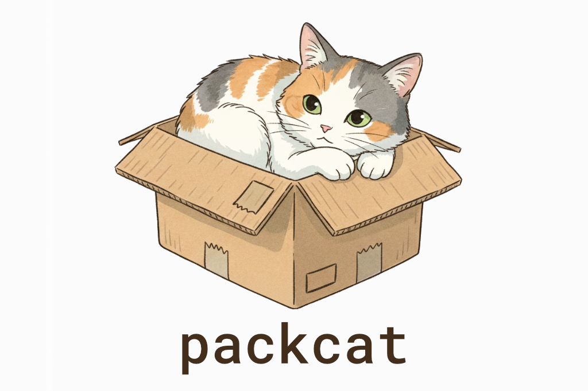

```sh
> npm install packcat
```

# packcat

packcat is a small library for serializing and deserializing objects to and from ArrayBuffers.

## Table Of Contents

- [Usage](#usage)
- [API Documentation](#api-documentation)
  - [Ser/Des](#serdes)
  - [Schema](#schema)
    - [Schema Utilities](#schema-utilities)
    - [Schema Types](#schema-types)

## Usage

First, define your data format with the schema utils:

```ts
import type { SchemaType } from 'packcat';
import { list, number, object, record, string, uint8 } from 'packcat';

const playerSchema = object({
    name: string(),
    health: number(),
    level: uint8(),
    inventory: record(object({ item: string(), qty: number() })),
    buffs: list(uint8()),
});

type PlayerType = SchemaType<typeof playerSchema>;
```

Next, you can create a serializer/deserializer for that schema, and use `SchemaType` to infer the TypeScript type of the schema:

```ts
import { serDes } from 'packcat';

const playerSerdes = serDes(playerSchema);

const player: PlayerType = {
    name: 'Hero',
    health: 100,
    level: 5,
    inventory: {
        sword: { item: 'Sword', qty: 1 },
        potion: { item: 'Health Potion', qty: 3 },
    },
    buffs: [1, 2, 3],
};

const buffer = playerSerdes.ser(player);

console.log(buffer); // ArrayBuffer

const deserialized = playerSerdes.des(buffer);

console.log(deserialized); // { name: 'Hero', health: 100, level: 5, inventory: { sword: [Object], potion: [Object] }, buffs: [ 1, 2, 3 ] }
```

You can also use `validate` if you don't trust whether the input data confirms to the schema type:

```ts
console.log(playerSerdes.validate(player)); // true

// @ts-expect-error this doesn't conform to the schema type!
console.log(playerSerdes.validate({ foo: 'bar' })); // false
```

## API Documentation

### Ser/Des

```ts
export function serDes<S extends Schema>(schema: S): {
    ser: (value: SchemaType<S>) => ArrayBuffer;
    des: (buffer: ArrayBuffer) => SchemaType<S>;
    validate: (value: SchemaType<S>) => boolean;
    source: {
        ser: string;
        des: string;
        validate: string;
    };
};
```

### Schema

#### Schema Utilities

```ts
export function boolean(): {
    type: 'boolean';
};
```

```ts
export function string(): {
    type: 'string';
};
```

```ts
export function number(): {
    type: 'number';
};
```

```ts
export function int8(): {
    type: 'int8';
};
```

```ts
export function uint8(): {
    type: 'uint8';
};
```

```ts
export function int16(): {
    type: 'int16';
};
```

```ts
export function uint16(): {
    type: 'uint16';
};
```

```ts
export function int32(): {
    type: 'int32';
};
```

```ts
export function uint32(): {
    type: 'uint32';
};
```

```ts
export function float32(): {
    type: 'float32';
};
```

```ts
export function float64(): {
    type: 'float64';
};
```

```ts
export function list<T extends Schema, L extends number>(of: T, length?: L);
```

```ts
export function tuple<T extends Schema[]>(of: T): {
    type: 'tuple';
    of: [
        ...T
    ];
};
```

```ts
export function object<F extends Record<string, Schema>>(fields: F): {
    type: 'object';
    fields: F;
};
```

```ts
export function record<F extends Schema>(field: F): {
    type: 'record';
    field: F;
};
```

```ts
export function bools(keys: string[]): {
    type: 'bools';
    keys: string[];
};
```

#### Schema Types

```ts
export type Schema = BooleanSchema | NumberSchema | Int8Schema | Uint8Schema | Int16Schema | Uint16Schema | Int32Schema | Uint32Schema | Float32Schema | Float64Schema | StringSchema | ListSchema | TupleSchema | ObjectSchema | RecordSchema | BoolsSchema;
```

```ts
export type BooleanSchema = {
    type: 'boolean';
};
```

```ts
export type StringSchema = {
    type: 'string';
};
```

```ts
export type NumberSchema = {
    type: 'number';
};
```

```ts
export type Int8Schema = {
    type: 'int8';
};
```

```ts
export type Uint8Schema = {
    type: 'uint8';
};
```

```ts
export type Int16Schema = {
    type: 'int16';
};
```

```ts
export type Uint16Schema = {
    type: 'uint16';
};
```

```ts
export type Int32Schema = {
    type: 'int32';
};
```

```ts
export type Uint32Schema = {
    type: 'uint32';
};
```

```ts
export type Float32Schema = {
    type: 'float32';
};
```

```ts
export type Float64Schema = {
    type: 'float64';
};
```

```ts
export type ListSchema = {
    type: 'list';
    of: Schema;
    length?: number;
};
```

```ts
export type TupleSchema = {
    type: 'tuple';
    of: Schema[];
};
```

```ts
export type ObjectSchema = {
    type: 'object';
    fields: Record<string, Schema>;
};
```

```ts
export type RecordSchema = {
    type: 'record';
    field: Schema;
};
```

```ts
export type BoolsSchema = {
    type: 'bools';
    keys: string[];
};
```
